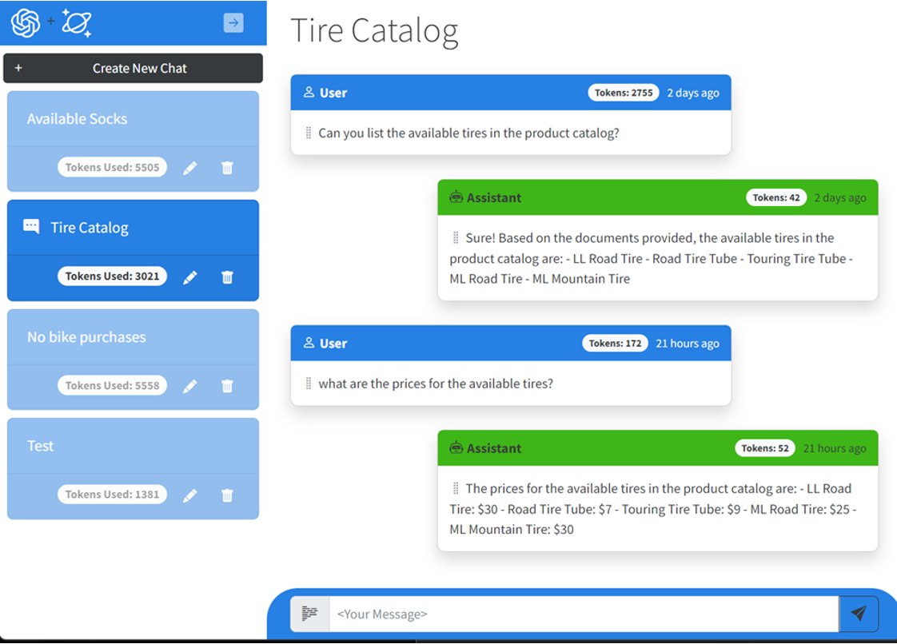

# Data Copilot for Azure Cosmos DB 

This solution demonstrates the use of Azure Cosmos DB + Azure OpenAI combination with useful generic functionality applicable to many Azure Cosmos DB deployments out there, that is – answering natural language questions about the data stored in Cosmos DB containers. It uses Cosmic Works dataset for retail (which could be replaced with any other dataset with some text in it) and answers some of the product questions intelligently, even though no provisions are done for retail specifically. 

Behind the scenes, it uses Azure Cache for Redis to cache and match embeddings and Azure Cosmos DB for persistent storage of original data, embedding vectors, and orchestration of the whole process through its Change Feed and Azure Functions integrations:

    

The necessary components for this solution include (all in the same region where OpenAI is present – EastUS/WestEurope/SouthCentralUS):
 
1.	Azure Cosmos DB database with containers with seed data (Cosmic Works 4) and embeddings
2.	Embedding Azure Function with Cosmos DB trigger 
3.	Azure OpenAI with Completions API and Embeddings API
4.	Azure Cache for Redis Enterprise
5.	Q&A Blazor App using Azure OpenAI driver and Redis driver
 
Optional components include:
 
6.	Azure Cognitive Search
7.	Enrichment Azure Function using ACS driver

## Deployment
1. Clone the repo and install prerequisites (.NET SDK, Azurite, Azure Functions SDK)
    
    a. Make sure all resources required are deployed in Azure subscription (e.g. Redis Enterprise, OpenAI with two models for embeddings and completions (text-ada-embeddings-002 and gpt-35-turbo))
    b. Make sure to start Azurite Blob Service before debuggin/running for Azure Functions's local storage
2. Create embedding collection in your Cosmos DB database with /id as a shard key and minimal throughput
3. Change the local.settings.json to reflect your subscription/services details (self-descriptive, or get working local.settings.json from authors)
4. Run/Debug and watch the embedding collection populated with all existing documents' embeddings and then adding new embeddings for every new/changed document
5. Submit the questions through the web page that comes up (e.g. http://localhost:8100) and see the response produced by ChatGPT on the same page:

    

