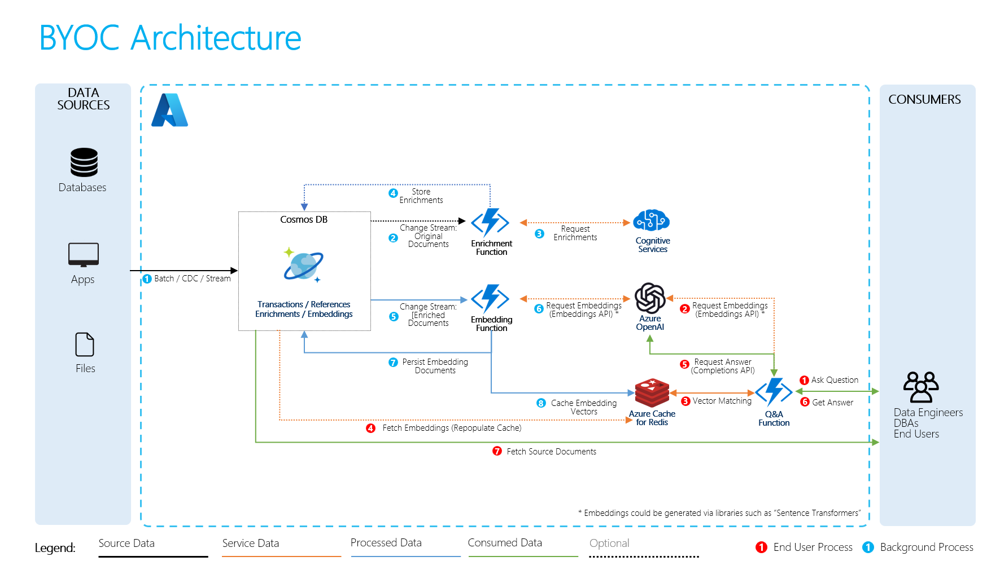

# Build Your Own Copilot (BYOC) for Azure Cosmos DB 

This solution demonstrates the use of Cosmos DB + OpenAI combination with useful generic functionality applicable to many Cosmos DB deployments out there, that is – answering natural language questions about the data stored in Cosmos DB containers. It uses Cosmic Works dataset for retail (which could be replaced with any other dataset with some text in it) and answers some of the product questions intelligently, even though no enrichments are done for retail specifically. 

Behind the scenes it uses Cosmos DB for persistent storage of original data, embedding vectors, and orchestration of the whole process through Change Feed and Azure Functions:

    

The necessary components for this solution include (all in the same region where OpenAI is present – EastUS/WestEurope/SouthCentralUS):
 
1.	Cosmos DB database with containers with seed data (Cosmic Works 4) and embeddings
2.	Embedding Azure Function with Cosmos DB trigger 
3.	Azure OpenAI with Completions API
4.	Azure Cache for Redis Enterprise
5.	Q&A Function using Azure OpenAI driver and Redis driver
 
Optional components include:
 
6.	Enrichment Function with ACS driver
7.	Azure Cognitive Search
8.	Azure OpenAI with Embeddings API

## Deployment
1. Clone the repo and install prerequisities (.NET SDK, Azure Functions SDK)
2. Create embedding collection in yoru Cosmos DB database with /id as a shard key and minimal throughput
3. Change the local.settings.json to reflect your subscription/services details (self-descriptive)
4. Run/Debug and watch the embedding collection populated