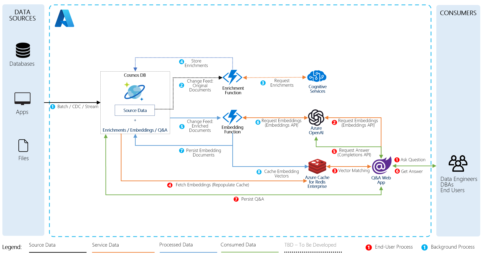

# Build Your Own Copilot (BYOC) for Azure Cosmos DB 

This solution demonstrates how to build generate embeddings or vectors on data stored in Azure Cosmos DB using OpenAI to use in a vector search scenario to answer specific questions about the data stored in Azure Cosmos DB in a consumer Retail "Intelligent Agent" scenario that allows users to ask questions on products and customer stored in the database. 

The data used in this solution is from the [Cosmic Works](https://github.com/azurecosmosdb/cosmicworks) sample for Azure Cosmos DB, adapted from the Adventure Works dataset for a retail Bike Shop that sells bicycles as well as biking accessories, components and clothing.

## Solution Architecture

This solution does not yet include Azure Cognitive Search. Will be added in a future version.

    

This solution is composed of the following services

1.	Azure Cosmos DB - Stores the operational retail data, generated embeddings and chat prompts and completions.
1.	Azure Functions - Hosts a Cosmos DB trigger to generate embeddings, Cosmos DB output binding to save the embeddings and Redis.
1.	Azure OpenAI - Generates embeddings using the embeddings API and chat completions using the completions API.
1.	Azure Cache for Redis Enterprise - For vector search.
1.	Azure App Service - Hosts Intelligent Agent UX.

## Getting Started

### Prerequisites

- Azure Subscription
- Subscription access to Azure OpenAI service. Start here to [Request Acces to Azure OpenAI Service](https://customervoice.microsoft.com/Pages/ResponsePage.aspx?id=v4j5cvGGr0GRqy180BHbR7en2Ais5pxKtso_Pz4b1_xUOFA5Qk1UWDRBMjg0WFhPMkIzTzhKQ1dWNyQlQCN0PWcu)

### Installation

1. Click "Deploy to Azure" button below.
1. Region should match one of the three regions listed below in "Location" to ensure all services are co-located in the same region.
1. Enter a name prefix for the deployed services. This should be a globally unique name with alpha-numeric characters only.
1. If you want to deploy from your own fork, modify, "App Git Repository" to point to your own fork of this repository.

The provided ARM or Bicep Template will provision the following resources:
1. Azure Cosmos DB account with a database and 4 containers at 1000 RU/s autoscale.
1. Azure App service. This will be configured to deploy the Search web application from **this** GitHub repository. This will work fine if no changes are made. If you want it to deploy from your forked repository, modify the Deploy To Azure button below.
1. Azure Open AI account with the `gpt-35-turbo` and `text-embedding-ada-002` models deployed.
1. Azure Functions. This will run on the same hosting plan as the Azure App Service.
1. Azure Cache for Redis Enterprise. **Please note that this service costs about $1000 USD per month.**

**Note:** You must have access to Azure Open AI service from your subscription before attempting to deploy this application.

All connection information for Azure Cosmos DB, Open AI and Redis is zero-touch and injected as environment variables into Azure App Service and Azure Functions at deployment time. 

### Doing initial data load

The data for this solution must be loaded once it has been deployed. The process for loading data also starts the process of generating vectors for all of the operational retail data in this solution. Follow the steps below.

1. Download and install the [Azure Cosmos DB Data Migration Desktop Tool](https://github.com/AzureCosmosDB/data-migration-desktop-tool/releases)
1. Copy the `migrationsettings.json` in the root folder for this repository and replace the version in the directory where you downloaded the tool above.
1. Open the file using any text editor.
1. Open the Azure Cosmos DB blade in the resource group for this solution.
1. Navigate to the Keys blade in Azure Portal and copy the Primary Connection String for the Cosmos DB account.
1. Paste the connection string in the two locations where it says, `ADD-COSMOS-CONNECTION-STRING`. Save the file.
1. Execute DMT.exe
1. You can watch Azure Functions processing the data by navigating to Azure Functions in the portal.

### Quickstart

1. After deployment, go to the resource group for your deployment and open the Azure App Service in the Azure Portal. Click the web url to launch the website.
1. Click + New Chat to create a new chat session.
1. Type in product and customer questions in the text box and press Enter.

Here are some sample questions you can ask:

- What kind of socks do you have available?
- Do you have any customers from Canada? Where in Canada are they from?
- What kinds of bikes are in your product inventory?

## Clean up

To remove all the resources used by this sample, you must first manually delete the deployed model within the Azure AI service. You can then delete the resource group for your deployment. This will delete all remaining resources.

## Run locally and debug

This solution can be run locally post deployment. Below are the prerequisites and steps.

### Prerequisites

- Visual Studio, VS Code, or some editor if you want to edit or view the source for this sample.
- .NET 7 SDK
- Azure Functions SDK v4
- Azureite, for debugging using Azure Functions's local storage.

### Local steps

#### Search Azure App Service
- Open the Configuration for the Azure App Service and copy the application setting values.
- Within Visual Studio, right click the Search project, then copy the contents of appsettings.json into the User Secrets. 
- If not using Visual Studio, create an `appsettings.Development.json` file and copy the appsettings.json and values into it.
 

#### Vectorize Azure Function
- Open the Configuration for the Azure Function copy the application setting values.
- Within Visual Studio, right click the Vectorize project, then copy the contents of local.settings.json and the application setting values into the User Secrets. If not using Visual Studio, create an `local.settings.Development.json` file and copy the local.settings.json and values into it.

## Resources

- [Upcoming blog post announcement](https://devblogs.microsoft.com/cosmosdb/)
- [Azure Cosmos DB Free Trial](https://aka.ms/TryCosmos)
- [Open AI Platform documentation](https://platform.openai.com/docs/introduction/overview)
- [Azure Open AI Service documentation](https://learn.microsoft.com/azure/cognitive-services/openai/)